# project-dv25-9

## Running the project

### Downloading the data

1. Install kaggle & kagglehub:
```shell
pip install kaggle
pip install kagglehub
```

2. Authenticate in kaggle. You'll need a kaggle token for this
```shell
kaggle config set -n path.kaggle_token_file -v path/to/your/kaggle.json
```

3. Run the script to install the data:
```shell
cd src/data
python download_data.py
```

### Installing dependencies

Go back to the root of the repository and install the needed packages:
```shell
npm install
```

### Starting the website

Run the development server:
```shell
npm run dev
```

## Report

# Gaming Profiles — Data Visualization Project

**Floris Kornelis van Dijken & Ruben Vandamme** · Group 9 · 1st Master Computer Science · Ghent University · May 2025

An interactive data visualization website exploring gamer behaviour using the [Gaming Profiles 2025 (Steam, PlayStation, Xbox)](https://www.kaggle.com/datasets/artyomkruglov/gaming-profiles-2025-steam-playstation-xbox) dataset (~60 GB). The site is structured around five key questions about gamers.

---

## Table of Contents

- [Introduction](#introduction)
- [What do gamers play on?](#what-do-gamers-play-on)
- [Where are gamers?](#where-are-gamers)
- [What do gamers think?](#what-do-gamers-think)
- [How do gamers spend?](#how-do-gamers-spend)
- [Which genres do gamers play?](#which-genres-do-gamers-play)
- [General design decisions](#general-design-decisions)
- [Task division](#task-division)

---

## Introduction

The Gaming Profiles dataset was chosen for three reasons: it contains real-world data, it is very large (~60 GB), and it offers many dimensions to explore (user activity, rankings, price changes, historical data, etc.).

The project originally targeted game developers as the primary audience, giving them actionable insights for their games. During exploratory work, however, it became clear that the dataset had limitations: few striking conclusions could be drawn, and expected relationships (e.g. linking countries via friend networks) turned out to be absent. The website therefore shifted to a more general, informative focus on **gamer behaviour**.

Cross-validation with external sources also revealed representativeness issues: many listed "games" are not actual games, and the United States appears as the largest user base even though China should be much larger in reality. The 60 GB size also worked against us — some visualizations (e.g. the scatter plot) load slowly despite optimizations.

---

## What do gamers play on?

### Cumulative game downloads

The original design showed downloads per month, but this was misleading: the dataset only contains a game's release date and its total download count — not when individual downloads occurred. Assigning all downloads to the release date falsely implied every copy was downloaded on launch day.

The fix was to switch to a **cumulative view**, building up total downloads over time, and extending the time window to make the trend more realistic. Platform launch dates (Steam, Xbox Store, PlayStation Store) were also added as reference markers.

**First version** (monthly downloads — misleading):

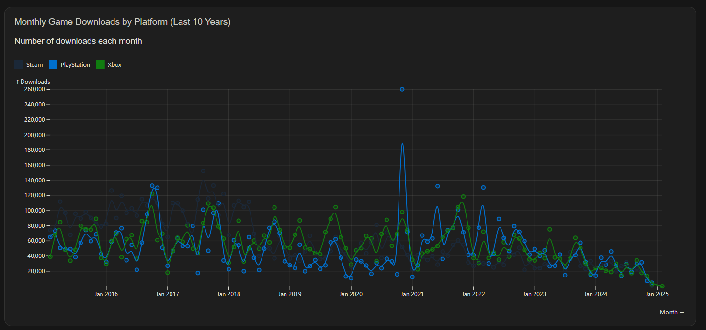

**Final version** (cumulative downloads + monthly releases):

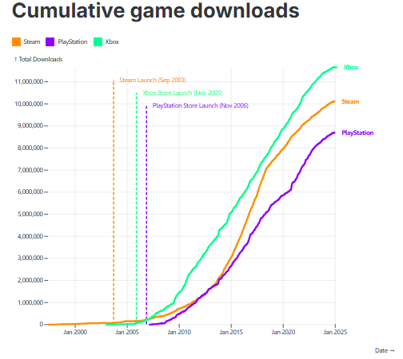

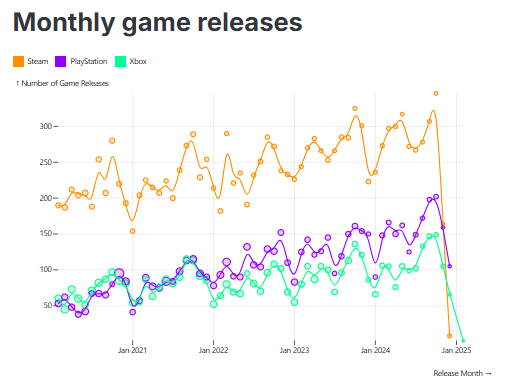

The second chart shows the number of game releases per month; bubble size encodes average downloads for games released that month — a property that is reliably present in the dataset.

---

## Where are gamers?

A choropleth map was the natural choice for showing geographic distribution. After hitting technical limitations with Vega-Lite, the project switched to an Observable geo plot. This introduced a name-matching problem: country names in the dataset did not match Observable's naming conventions (the United States appeared grey in an early version).

A mapping table was built to translate dataset country names to Observable's expected names. A companion bar chart was added so exact values are easier to read. During analysis, a skew in the dataset was also discovered and is noted on the website.

**Early version** (US not rendering correctly):

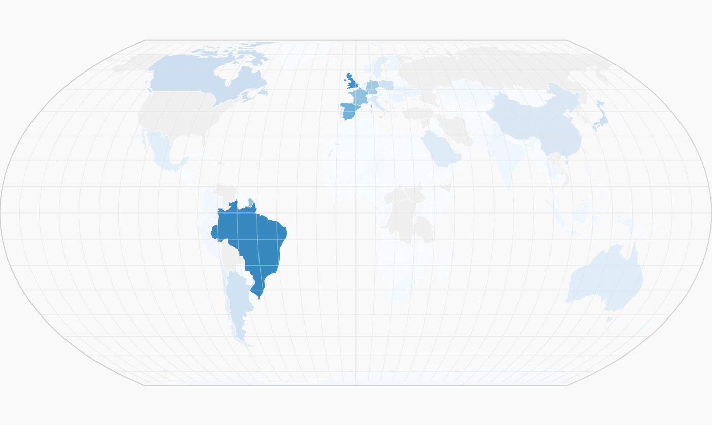

**Final version**:

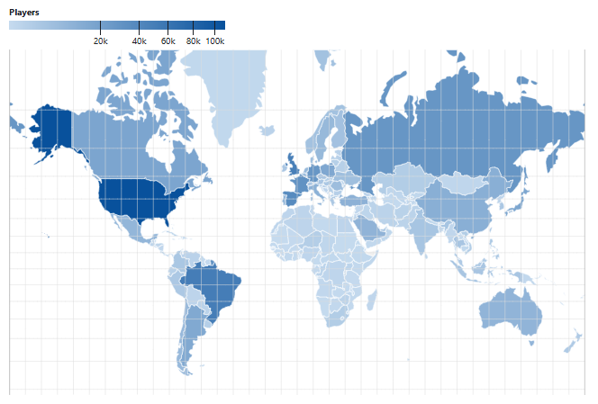

---

## What do gamers think?

Review analysis required filtering the dataset to English-only reviews first. After that, naive word frequency turned up "the" and then "game" as top terms — neither useful. The breakthrough was focusing on **adjective + noun combinations**, which produced meaningful patterns visualized as a word cloud. A bar chart showing exact frequencies was added alongside it.

**Final word cloud**:

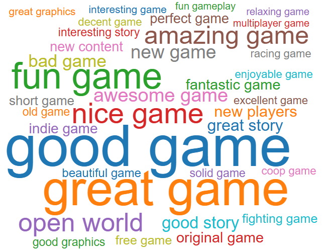

---

## How do gamers spend?

### Game yields

This scatter plot shows **game price (€) vs. downloads**, with colour encoding total yield (revenue). It started as an introduction-page element aimed at developers, then moved to the "How do gamers spend?" section with axis titles reframed as questions to improve the narrative flow.

**First version** (dark theme, labelled "Profit"):

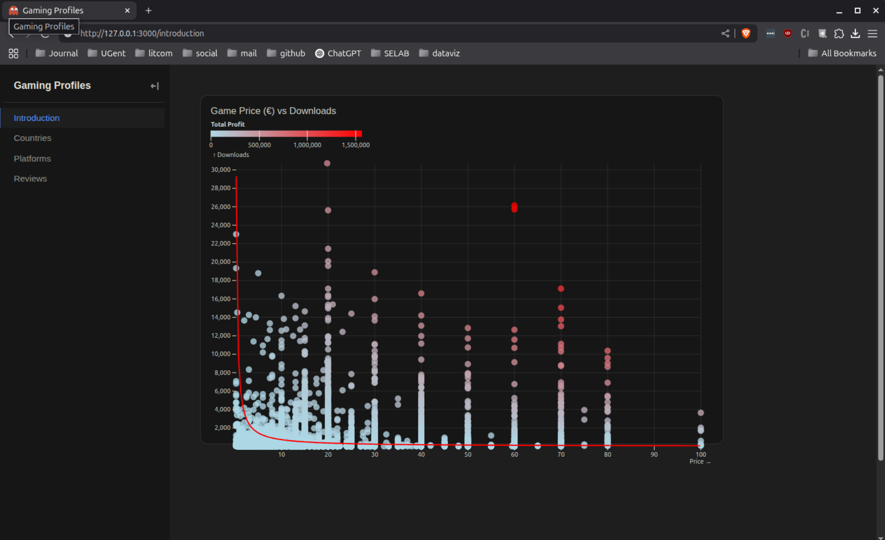

Several iterations were made:

- **"Profit" → "Yield"**: After feedback, the term *Profit* was replaced with *Yield* because costs were not factored in — yield more accurately reflects the underlying calculation.
- **Top-5 permanent labels**: Game titles are only visible on hover by default, so the five most popular titles were pinned permanently. Labels alternate left/right to avoid overlap.
- **Average yield line**: A red/grey reference line now carries an explicit label with the numeric value (e.g. *Average yield (7,282€)*), making it self-explanatory without relying on surrounding text.
- **Platform filter**: A radio-button selector was added to compare behaviour across Steam, PlayStation, and Xbox.
- **Data cleaning**: Low-yield data points were thinned probabilistically (lower yield = higher removal probability) to reduce visual clutter and improve load times. The average line is still computed over the full dataset. Outliers with prices above €100 and near-zero downloads were clipped.

**Final version**:

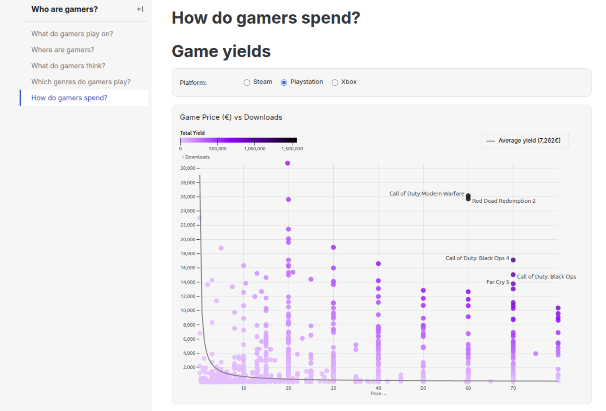

---

## Which genres do gamers play?

### Correlation between genres

This heatmap visualizes how often games belong to multiple genres simultaneously (co-occurrence).

**First version** (absolute counts, broken diagonal):

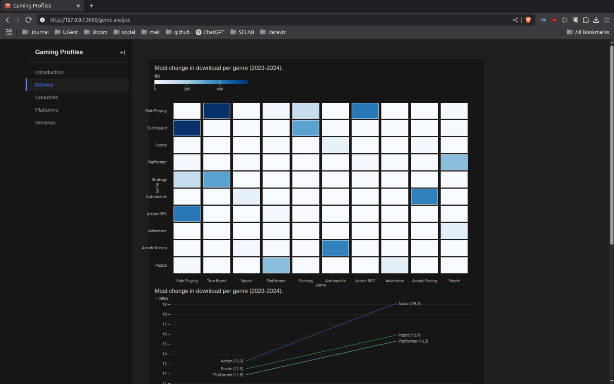

Key iterations:

- **Diagonal fix**: The diagonal (a genre with itself) was initially not at maximum because self-pairs were excluded. Including self-pairs sets the diagonal to the correct 100%.
- **Absolute → relative**: Dividing each cell by the total number of games in that row's genre gives relative co-occurrence frequencies, making the matrix asymmetric and revealing additional relationships. The diagonal now uniformly shows 100%.
- **Interactive tooltips**: Hovering shows a plain-language explanation, e.g. *Racing games that are also Simulation: 32.1%*.
- **Filtering controls**: A minimum-games-per-genre threshold, a genre selector (checkbox grid), and alphabetical sorting were added to handle the large number of genres without clutter.
- **UX improvement**: The slider + input field combination was simplified to just an input field; the percentage of included games is displayed live below the chart.

**Final interface**:

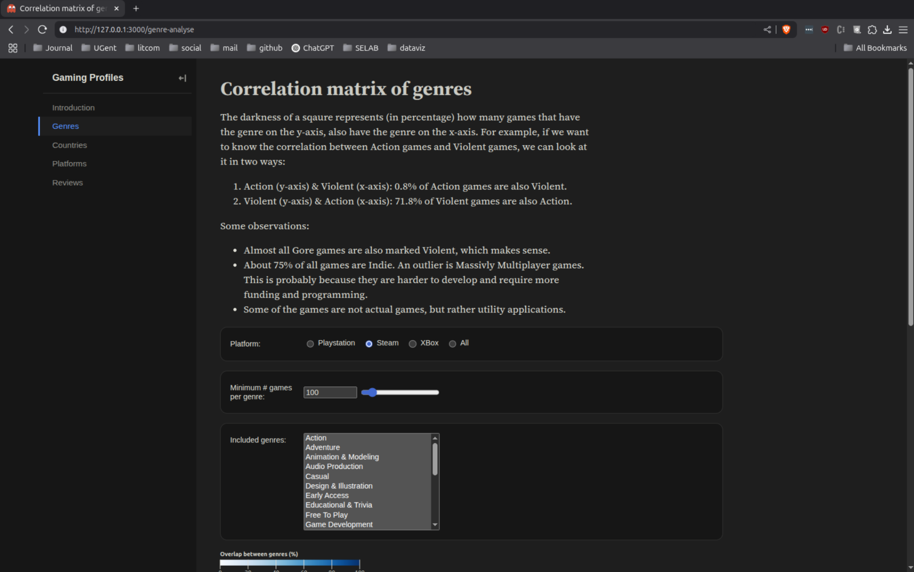

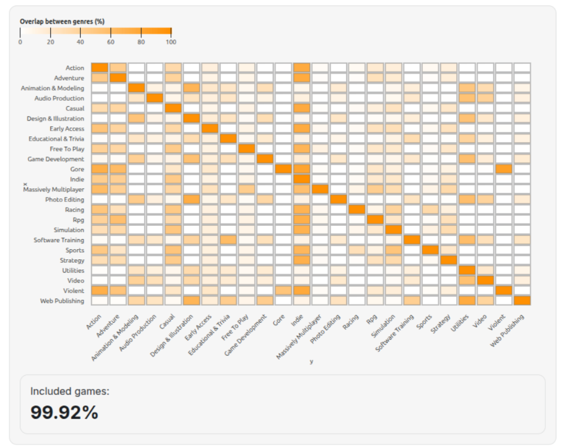

---

### Game release trend

The original idea was a slope graph with two year-selectors so users could compare any two years. This turned out to be too cumbersome: it required a lot of interaction and delivered no clear insight without actively searching for one. The approach was replaced with a **line graph showing all years simultaneously**, making trends immediately visible.

**Slope graph (first version)**:

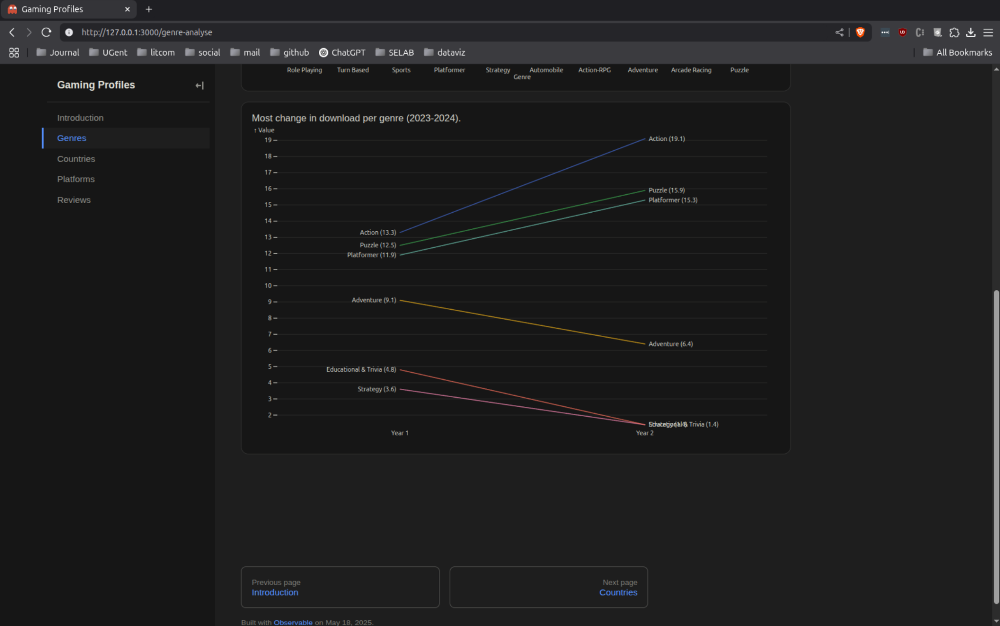

**Final line chart** (relative mode):

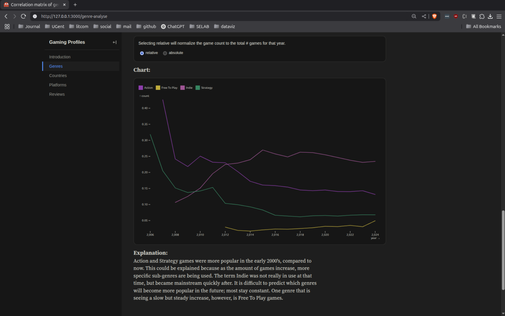

Additional choices:
- **Relative vs. absolute**: In absolute mode, every genre appears to grow — simply because more games are released each year. The relative option normalizes by total games released that year to reveal genuine shifts in genre popularity.
- **Minimum threshold**: The minimum is capped at 100 games to avoid misleading percentage swings in small genres (e.g. 1 → 2 games = +100%).
- **2025 excluded**: The year 2025 is incomplete in the dataset and would create an artificial-looking drop, so it is hidden.
- **Color scheme**: After trying the `iwanthue` package, a simple rainbow sequence was chosen as it proved most visually distinguishable in practice.

---

## General design decisions

| # | Decision | Rationale |
|---|----------|-----------|
| 1 | **Triadic color scheme per platform** | Provides sufficient contrast and visual harmony across Steam, PlayStation, and Xbox |
| 2 | **Interactive table of contents** | Gives users a quick overview of all sections |
| 3 | **Question-based section titles** | Strengthens the narrative flow and encourages curiosity |
| 4 | **Extended storytelling** | Feedback from earlier presentations showed that contextual anecdotes alongside charts were expected, not just technical descriptions |
| 5 | **White theme** | Replaced the dark theme for better readability |

---

## Task division

| Ruben | Floris |
|-------|--------|
| How do gamers spend? — Game yields | Observable Framework setup |
| Which genres do gamers play? — Correlation matrix | What do gamers play on? — Cumulative downloads line graph |
| Which genres do gamers play? — Game release trend | What do gamers play on? — Monthly releases line graph |
| | Automatic deployment to GitHub Pages |
| | Where are gamers? — Choropleth map |
| | Where are gamers? — Bar chart |
| | What do gamers think? — Word cloud |
| | What do gamers think? — Word frequency bar chart |

*Items not listed above were done together.*

---

## Dataset

- **Kaggle**: [Gaming Profiles 2025 (Steam, PlayStation, Xbox)](https://www.kaggle.com/datasets/artyomkruglov/gaming-profiles-2025-steam-playstation-xbox)
- **GitHub (source)**: [Smipe-a/gamestatshub](https://github.com/Smipe-a/gamestatshub)
